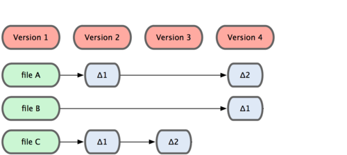
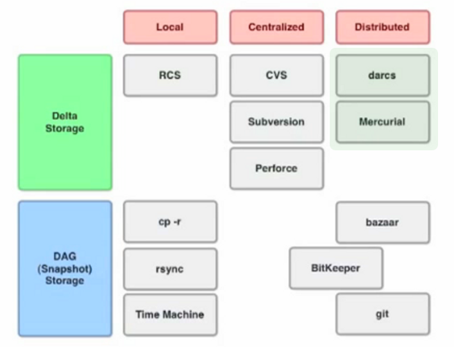

!SLIDE smaller bullets incremental
# Qué es git? #
* es un sistema de _código abierto_ de control de versiones _distribuido_, diseñado para ser _veloz y eficiente_

.notes segunda acepción: un rastreador estúpido/simple de info - [stupid content tracker](http://translate.google.com/#auto|es|you%20are%20a%20git)

!SLIDE smaller bullets incremental
## Un poco de historia ##
* se desarrolló como control de versiones para el kernel del SO Linux en el 2005
* su autor es Linus Torvalds (autor tb del kernel linux)
* dato curioso 1: comenzó a desarrollar el 3 Abril 2005, en Julio 2005 pasó a etapa de mantenimiento, la release 1.0 salió a finales del 2005.
* dato curioso 2: qué se usó para versionarlo? El 6 de Abril se usó para auto-hostear su código

!SLIDE bullets incremental transition=fade
#Qué no es Git#

* definitivamente _NO_ es una evolución de Subversion

!SLIDE smaller
## Taxonomías  SCM (source code management)##
* clasificación según almacenamiento: diffs/deltas , DAG/snapshots
* clasificación según arquitectura: local, centralizado, distribuido

!SLIDE
## Almacenamiento##
### Delta ###

!SLIDE
## Almacenamiento##
### Delta ###

!SLIDE
## Almacenamiento##
### Delta ###

!SLIDE
## Almacenamiento##
### Delta ###

!SLIDE
## Almacenamiento##
### Delta ###

!SLIDE
## Almacenamiento##
### Snapshot o DAG ###

!SLIDE
## Almacenamiento##
### Snapshot o DAG ###

!SLIDE
## Almacenamiento##
### Snapshot o DAG ###

!SLIDE
## Almacenamiento##
### Snapshot o DAG ###

!SLIDE
## Almacenamiento##
### Snapshot o DAG ###

!SLIDE
## Almacenamiento ##
### Delta vs Snapshot###

!SLIDE transition=fade
## Taxonomía ##

!SLIDE
## Taxonomía ##

!SLIDE
## Taxonomía ##

!SLIDE
## Taxonomía ##

!SLIDE
## Taxonomía ##

!SLIDE
## Taxonomía ##

!SLIDE
## Taxonomía ##

.notes min 21:07 video schacon, o 27:19 gallantgames
