!SLIDE
    Cómo funciona?

!SLIDE
    Estructura del repositorio

!SLIDE smaller transition=fade

## git directory ##

.git (sólo en el root de la carpeta de trabajo)

    $ tree .git
    .git
    |-- config
    |-- description
    |-- HEAD
    |-- hooks
    |   |-- commit-msg.sample
    |-- index
    |-- info
    |   `-- exclude
    |-- objects
    |   |-- info
    |   `-- pack
    `-- refs
        |-- heads
        `-- tags

!SLIDE bullets incremental transition=fade
## Git Directory ##
* config
* hooks
* index
* object database
* references

!SLIDE smaller bullets incremental transition=scrollUp
## Object database ##
* content
* new_content = type + ' ' + content.size + \0
* sha = Digest::SHA1.digest(new_content)
* "b17b55b9f1a8e715db59a..."
* compressed = zlib::deflate(new_content)
* path = .git/objects/b1/7b55b9f1a8e...
* File.open(path, 'w') {|f| f.write(compressed)}

.notes min 13:23 video gallantgames

!SLIDE bullets incremental transition=fade
## Object database ##
* "loose" format 

!SLIDE bullets smaller incremental transition=scrollUp
## Object database ###
* gc (recolector de basura)
* mismo fichero con diferencias menores

*   .git/objects/5b/be38dff97fdc3f9db42539fa2eaf2993c24445
    .git/objects/81/5e06841b80897afd8fe5686dc610e045af1911
    .git/objects/dd/40e9ec9d8ccdd6d9b1f140992b947a657dd7a4
    .git/objects/fe/13dfa3393aaa7e9e0276067501f691df8ecda2

*   .git/objects/pack/pack-b916c14d0420eaaca7a2d9eeea2fd851d4e5b48a.pack
    .git/objects/pack/pack-b916c14d0420eaaca7a2d9eeea2fd851d4e5b48a.idx

!SLIDE bullets incremental transition=fade
## Object database ##
* "packed" format

!SLIDE transition=scrollRight
## Object database ##

!SLIDE bullets smaller incremental transition=fade
## Object database ##
* blob
* cada fichero/file es un blob

!SLIDE smaller transition=fade
## Object database ##
blob

!SLIDE bullets smaller incremental transition=fade
## Object database ##
* tree 
* cada directorio/carpeta se representa con un tree

!SLIDE bullets smaller transition=fade
## Object database ##
* tree 
* cada directorio/carpeta se representa con un tree

!SLIDE smaller transition=fade
## Object database ##
tree

!SLIDE bullets smaller transition=fade
## Object database ##
* commit
* un puntero a un root tree +
* metadata commit (parent, autor, commiter, fecha, mensaje)

!SLIDE bullets smaller transition=fade
## Object database ##
DAG

!SLIDE transition=fade
## Object database ##

!SLIDE bullets incremental transition=fade
## Object database ##
tag

* .git/objects/20/c71174453dc760692cd...
* .git/refs/tags/v1.0

!SLIDE
## Object database ##

!SLIDE transition=fade
## Object database ##

INMUTABLES !

!SLIDE bullets incremental 
## Muy importante! ##
* una vez commiteado no se puede perder (bueno casi)
* la historia no se borra, sino
* se escribe una historia alternativa
* es muy seguro (el SHA1 es crypto safe)

!SLIDE bullets incremental transition=scrollLeft
## references ##
* punteros "livianos", móviles a distintos commits
* guardados en .git/refs/*

!SLIDE bullets incremental
# references #

!SLIDE transition=fade
# Ejemplo #

!SLIDE transition=fade
# Ejemplo #

!SLIDE transition=fade
# Ejemplo #

!SLIDE transition=fade
# Ejemplo #

!SLIDE transition=fade
# Ejemplo #

!SLIDE transition=fade
# Ejemplo #

!SLIDE transition=fade
# Ejemplo #

!SLIDE transition=fade
# Ejemplo #

!SLIDE transition=fade
# Ejemplo #

!SLIDE transition=scrollLeft
# El índice: 3 cabezas piensan mas que 2 #

!SLIDE bullets incremental 
## Index ##
### area intermedia (staging area) ###

!SLIDE transition=fade
### Index ###

!SLIDE transition=fade
### Index ###

!SLIDE transition=fade
### Index ###

!SLIDE transition=fade
### Index ###

!SLIDE transition=fade
### Index ###

!SLIDE bullets incremental 
## Index ##
* no es necesario commitear todo de una 
* elegir las partes a commitear (git add --patch)
* ayuda a hacer review de tus cambios
* permite tener una historia de cambios mas ordenada y entendible

!SLIDE
# Respositorios alienígenas o remotos #
Los repositorios remotos permiten compartir el código, básicamente son copias de ntra. base de objetos, para _sincronizarlos_ usamos: *push*, *fetch* (*pull*).

!SLIDE smaller
## Protocolos ##
* ssh:// (push y pull)
* http[s]:// (pull - sólo lectura)
* git:// (pull)
* file:// (push y pull)
* rsync:// <-- deprecated
* ftp:// <-- deprecated

!SLIDE
##Repo remoto##
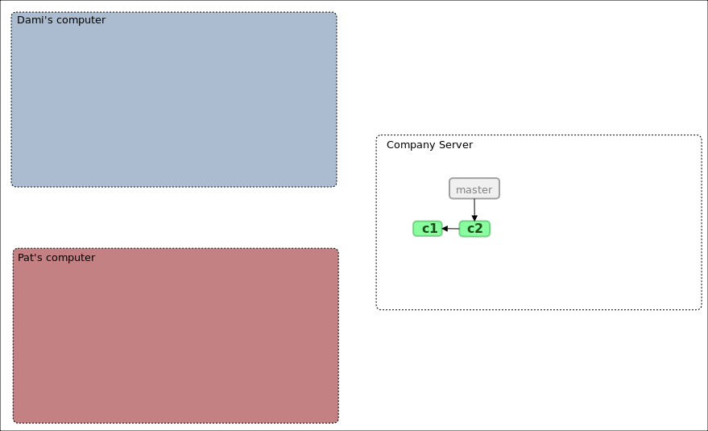

.notes 42:00 video gallantgames

!SLIDE transition=fade
##Repo remoto##
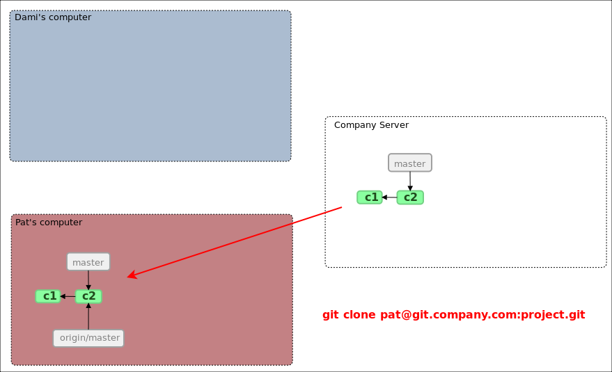

!SLIDE transition=fade
##Repo remoto##
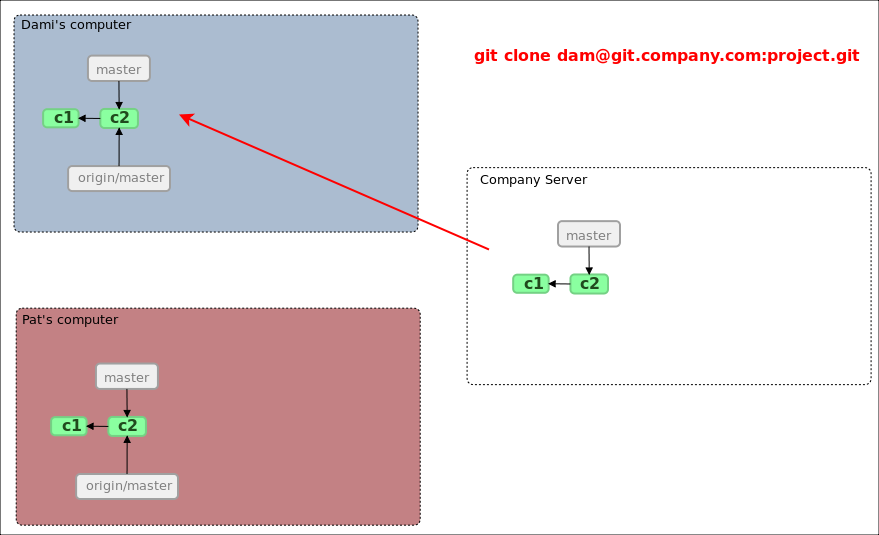

!SLIDE transition=fade
##Repo remoto##
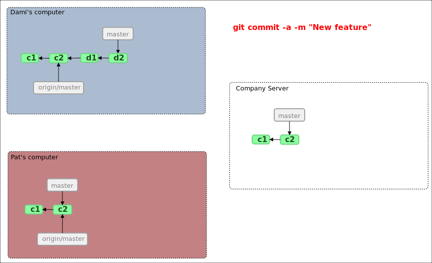

!SLIDE transition=fade
##Repo remoto##
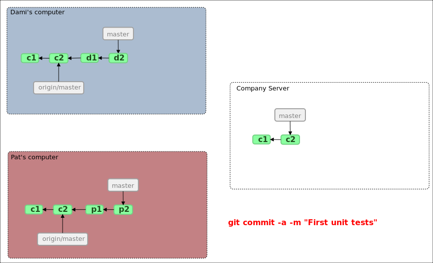

!SLIDE transition=fade
##Repo remoto##
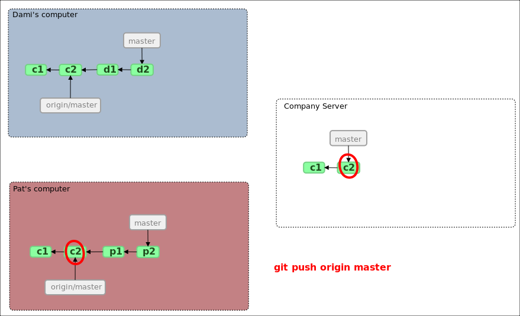

!SLIDE transition=fade
##Repo remoto##
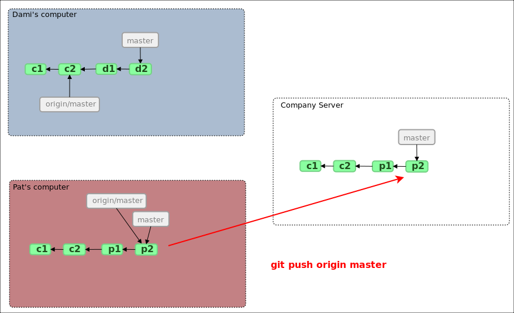

!SLIDE transition=fade
##Repo remoto##
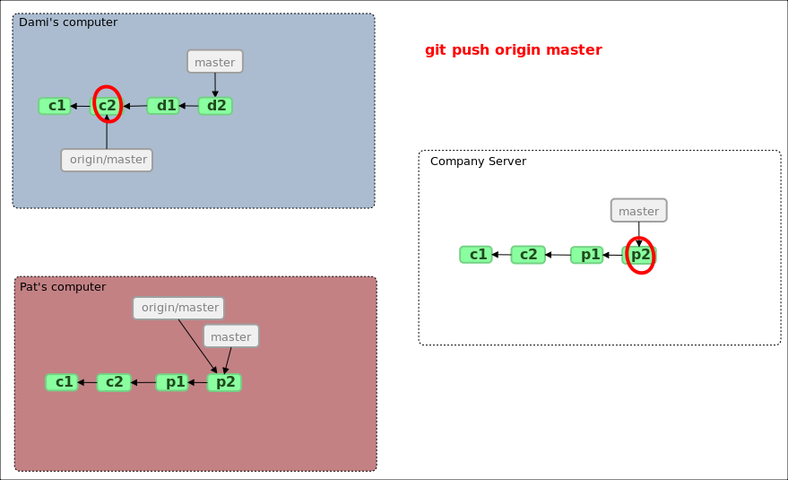

!SLIDE transition=fade
##Repo remoto##
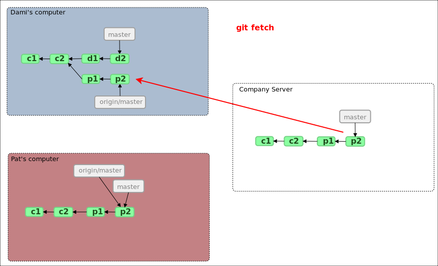

!SLIDE transition=fade
##Repo remoto##
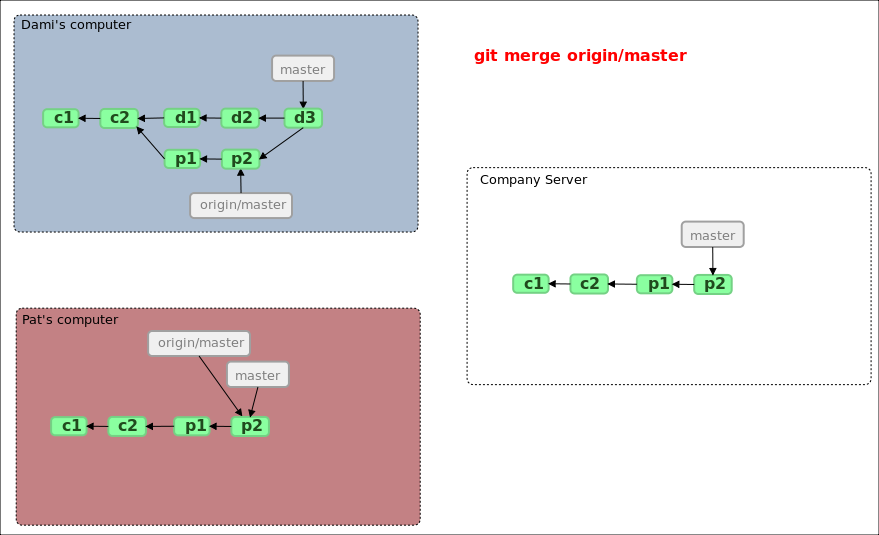

!SLIDE transition=fade
##Repo remoto##

!SLIDE transition=fade
##Repo remoto##
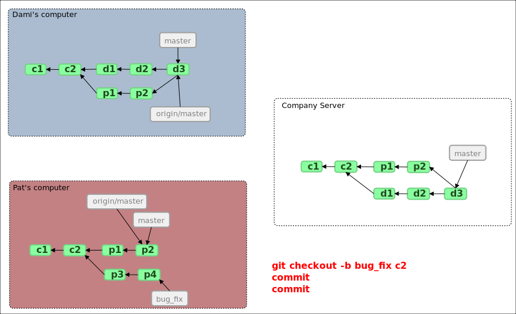

!SLIDE transition=fade
##Repo remoto##
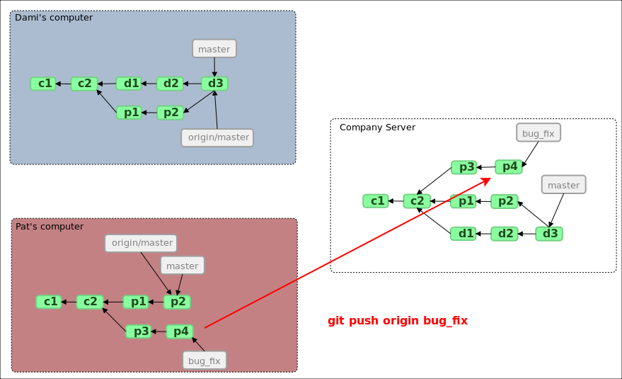

!SLIDE transition=fade
##Repo remoto##
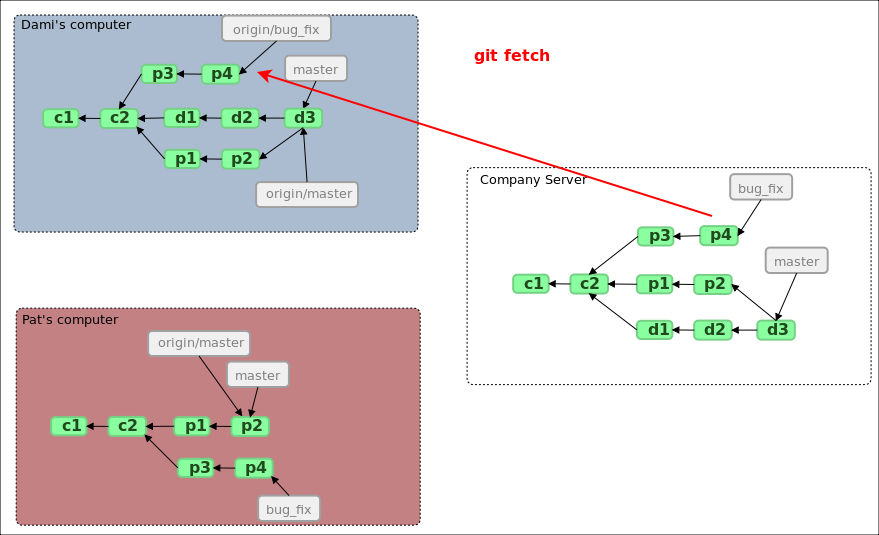

!SLIDE transition=fade
##Repo remoto##
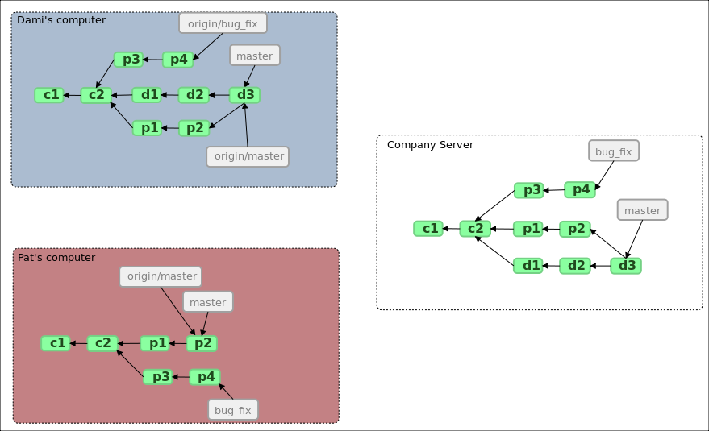

!SLIDE
##Modelos de interacción con Remotes##
### Repo centralizado ###

!SLIDE
##Modelos de interacción con Remotes##
### Repo tipo Integration Manager ###

!SLIDE
##Modelos de interacción con Remotes##
### Repo Dictador-Teniente ###

!SLIDE smaller smbullets incremental
# En definitiva ... conclusiones #
* Su diseño y naturaleza distribuida hacen que Git sea: 

 * rápido y eficiente (las operaciones mas usadas son locales)
 * todos tienen una copia, por ende hay muchos backups ;)
 * no se necesita estar conectado para:
  + ver la historia de un file
  + hacer un branch
  + mergear código
  + commitear código
  + ver diferencias entre versiones
  + obtener cualquier versión de un file

.notes características sobresalientes a un Distributed vcm : min 9:20 -  10:30 

